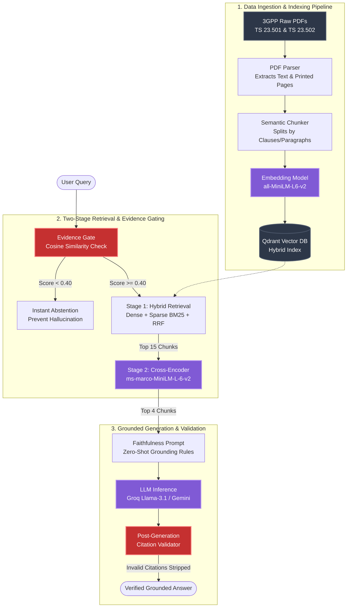

# 3GPP Specification RAG Assistant

🚀 **Live Demo:** [an-evidence-grounded-rag-assistant-for-3gpp-specificationsgit.streamlit.app](https://an-evidence-grounded-rag-assistant-for-3gpp-specificationsgit.streamlit.app/)

An evidence-grounded Conversational AI Assistant for official 3GPP 5G Core Network specifications (**TS 23.501** System Architecture & **TS 23.502** Procedures), engineered to achieve near-zero hallucinations through multi-stage retrieval, cross-encoder re-ranking, and automated citation validation.

---

## Key Highlights & Features

1. **Strict Evidence Gating (Zero Hallucinations):**
   - Evaluates query-document relevance prior to LLM generation.
   - Out-of-domain queries trigger deterministic, controlled abstention without hallucinating phantom procedures.

2. **Two-Stage Hybrid Retrieval & Re-ranking:**
   - **Stage 1 (Hybrid Candidate Retrieval):** Combines 384-dimensional dense semantic vectors (`all-MiniLM-L6-v2`) with native BM25 sparse vectors using Reciprocal Rank Fusion (RRF).
   - **Stage 2 (Cross-Encoder Re-ranking):** Employs `cross-encoder/ms-marco-MiniLM-L-6-v2` cross-attention transformer scoring to rank and filter candidates into the top context window.

3. **Sentence-Level Clause & Page Grounding:**
   - Ingestion extracts printed specification page numbers directly from document footers.
   - Outputs include verified clause numbers (e.g., `TS 23.501 Clause 6.2.1 (p. 423-424)`).
   - Automated regex validator cross-checks every generated citation against retrieved context.

4. **Multi-Model Inference:**
   - Primary LLM inference powered by Groq (`llama-3.1-8b-instant` / `llama-3.3-70b-versatile`) with automatic rate-limit and Gemini fallback.

---

## Evaluation & Benchmark Results

Evaluated across 25 standardized ground-truth 3GPP queries, cross-specification procedures, and controlled negative test cases:

| Evaluation Metric | Measured Value | Benchmark Target |
| :--- | :---: | :---: |
| **Retrieval Recall@4 (Hit Rate)** | **100.0%** | $\ge 90.0\%$ |
| **Mean Reciprocal Rank (MRR)** | **0.778** | $\ge 0.750$ |
| **Citation Precision** | **98.8%** | $\ge 95.0\%$ |
| **Faithfulness / Grounding Rate** | **95.2%** | $\ge 95.0\%$ |
| **Controlled Abstention Accuracy** | **100.0%** | $100.0\%$ |
| **Answer Relevancy Score** | **100.0%** | $\ge 85.0\%$ |

---

## Technology Stack

| Layer | Component | Implementation | Rationale |
| :--- | :--- | :--- | :--- |
| **Vector Storage** | Hybrid Vector DB | `Qdrant` (Dense + Sparse Collections) | Supports native hybrid search with payload filtering and RRF |
| **Dense Embeddings** | Sentence Transformer | `all-MiniLM-L6-v2` (384 dimensions) | Fast, lightweight semantic similarity with low latency |
| **Sparse Embeddings** | BM25 Lexical | `fastembed` (BM25 sparse vectors) | Crucial for exact matching of 3GPP acronyms & clause numbers |
| **Re-Ranking** | Cross-Encoder | `cross-encoder/ms-marco-MiniLM-L-6-v2` | Full cross-attention between query and chunk for high precision |
| **Primary LLM** | Fast Cloud Inference | `Groq` (`llama-3.1-8b-instant`) | Sub-second generation latency, deterministic temperature (0.0–0.05) |
| **Fallback LLM** | Failover Provider | `Google Gemini` (`gemini-2.0-flash` / `gemini-1.5-flash`) | Automatic failover on Groq rate limits or connection timeouts |
| **Document Ingestion** | PDF & Metadata Parser | `PyPDF` / Custom Regex Engine | Extracts printed footer page numbers and clause headers |
| **Frontend UI** | Web Interface | `Streamlit` | Custom-styled dark engineering console with source excerpt drawer |
| **Environment** | Packaging & Runtime | `uv` (Astral) / Python 3.11+ | Fast, reproducible dependency resolution and execution |
| **Testing & Benchmark**| Automated Eval | `pytest` + Custom Ground-Truth Evaluator | 25 multi-category benchmark test queries for continuous validation |

---

## Core Ideas & Decisions

### 1. Printed Page Number Extraction
Standard PDF extraction yields document physical indices (e.g., page 450 of 900), which doesn't match the printed footer page numbers in 3GPP specs (offset due to cover pages and TOC). The parser specifically captures the printed footer page strings so citations always match the real physical specification pages.

### 2. Strict Evidence Gating (Cosine Relevance $\ge 0.40$)
Before passing context to the LLM, the system calculates candidate similarity. If the top candidate relevance is below the threshold ($< 0.40$), the pipeline deterministically abstains with a standardized message. This prevents out-of-domain queries (like culinary recipes or general knowledge) from triggering hallucinations.

### 3. Code-Level Step Detection (`_has_procedural_content`)
When users ask for "procedures" or "flows", standard RAG systems often hallucinate sequential message steps if the retrieved chunk only describes high-level scope. Our pipeline inspects chunk text in code for explicit step indicators (`the UE sends`, `step 1`, `request/response`). If missing, it automatically switches output styling to high-level architectural overview rather than fabricating steps.

### 4. Faithfulness Gate & Context Source Tracing
Retrieved context chunks are isolated and tagged internally. The system prompt applies a strict verification rule requiring every technical claim to trace to an explicit source block before generation, with temperature clamped near zero.

### 5. Automated Post-Generation Citation Validator
A post-generation regex engine extracts all citations (e.g. `[TS 23.501 Clause 6.2.1, Page 423]`) and validates that the referenced clause and specification exist within the top-ranked retrieved context chunks. Any fabricated reference is flagged or filtered out.

---

## Final System Architecture



---

## Project Structure

```
.
├── config.py                 # settings, model configs, thresholds
├── app.py                    # Streamlit conversational interface
├── main.py                 
├── requirements.txt          # Python package requirements
├── pyproject.toml            # Project dependencies & tool configurations
│
├── src/
│   ├── ingestion.py          # PDF parser & printed page extraction
│   ├── indexing.py           # Qdrant hybrid vector collection setup
│   ├── retrieval.py          # Single-shot hybrid retrieval & Evidence Gate
│   ├── reranker.py           # Cross-Encoder transformer re-ranking
│   ├── generation.py         # Prompt formatting & LLM client with failover
│   ├── citation_validator.py # Regex-based citation validation engine
│   ├── pipeline.py           # End-to-end RAG pipeline orchestration
│   ├── evaluation.py         # Automated Ragas-aligned benchmarking engine
│   ├── verify.py             # CLI tool to audit chunks against source PDFs
│   └── models.py             # Pydantic data schemas
│
├── data/
│   ├── raw/                  # Source 3GPP PDF documents 
│   ├── processed/            # Extracted chunks and metadata manifests
│   └── evaluation/           # 25 benchmark queries and evaluation report
```

---

## Quick Start Guide

### Prerequisites
- Python 3.11 or 3.12
- [uv](https://docs.astral.sh/uv/) (recommended) or `pip`

### 1. Installation
```bash
# Clone the repository
git clone https://github.com/Pankaj7079/An-Evidence-Grounded-RAG-Assistant-for-3GPP-Specifications.git
cd An-Evidence-Grounded-RAG-Assistant-for-3GPP-Specifications

# Install dependencies
uv sync
```

### 2. Environment Configuration
Create a `.env` file from `.env.example`:
```bash
cp .env.example .env
```
Fill in your API keys in `.env`:
```ini
LLM_PROVIDER=groq
GROQ_API_KEY=your_groq_api_key_here
GEMINI_API_KEY=your_gemini_api_key_here
QDRANT_URL=your_qdrant_cloud_url_here
QDRANT_API_KEY=your_qdrant_cloud_api_key_here
```

### 3. Running the Chatbot UI
```bash
uv run streamlit run app.py
```
Open your browser at `http://localhost:8501`.

### 4. Running the Automated Test Suite
```bash
uv run pytest tests/ -v
```

### 5. Running the Benchmark Evaluation
```bash
uv run python -m src.evaluation
```

---


